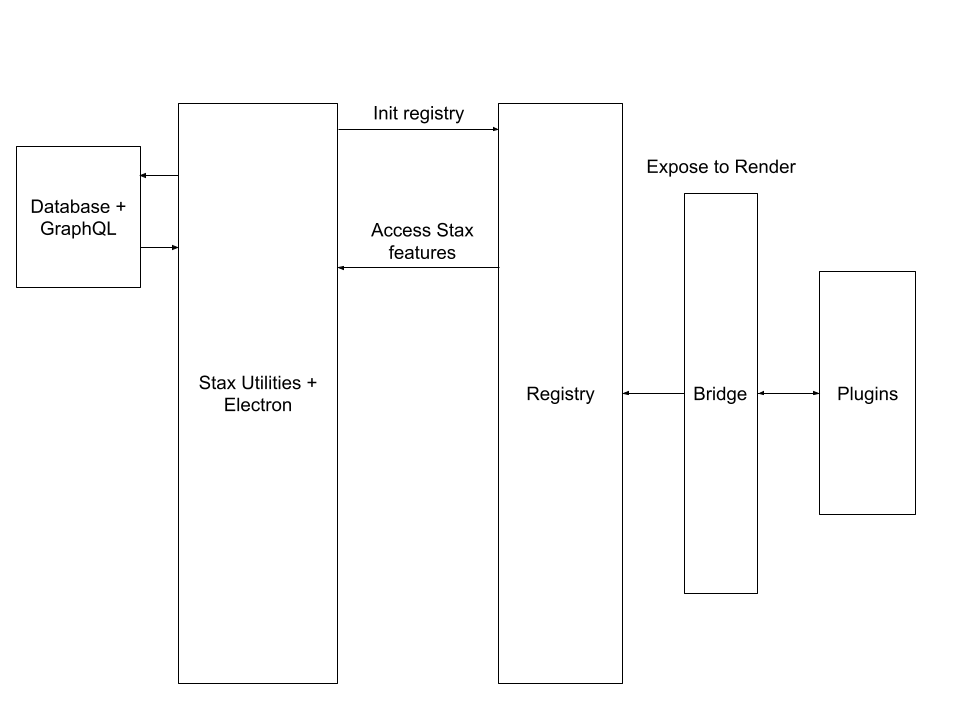

# Stax Plugins Docs

## Architecture

Stax create a registry, reading all plugins installed.
When a plugin is installed file installed-lock.json is updated with new plugin. Readed plugins are logged in eletron console.

After registry is created, Stax provide to render process an new API to access Stax features (database, notification, etc).

Plugin can access this API via Window object. All APIS is related [here](../@types/window.d.ts).
