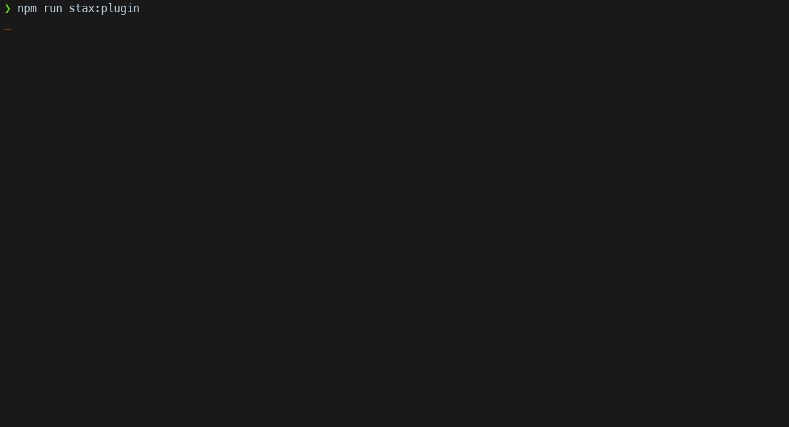

# Stax Plugins CLI

You can use this for create, update, delete, install or uninstall plugins.

## Create

Create basically scaffold Svelte + Typescript project for you.

Create command, return one folder level and execute `vite crete`, `npm i` using plugin name more `stax-plugin-` prefix.

After running create command and started plugin with `npm run dev` you should view this screen:

## Delete

Delete command, return one folder level and try read all folders projects with `stax-plugin-` prefix in name.

Then select which plugin folder want delete, so confirm.

## Update

Not implemented yet.

## Install

Not implemented yet.

## Uninstall

Not implemented yet.